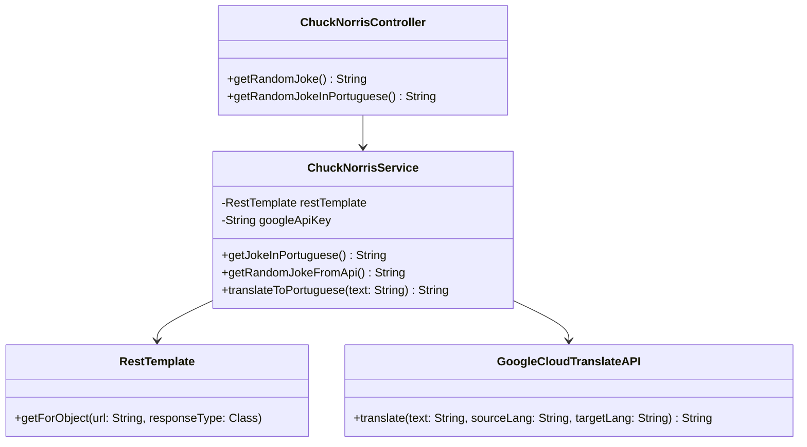

# Chuck Norris Jokes API

Este projeto consiste em uma API RESTful simples construída com **Java** e **Spring Boot**, que fornece piadas aleatórias sobre Chuck Norris. A API consome dados de uma API externa de piadas sobre Chuck Norris e os expõe por meio de um endpoint acessível via HTTP.

## Tecnologias Utilizadas

* **Java 17+**
* **Spring Boot 3.x**
* **Spring Web**: Para criação e configuração da API RESTful.
* **RestTemplate**: Para fazer requisições HTTP à API externa de piadas.
* **Lombok**: Para reduzir o código boilerplate.
* **Maven**: Para gerenciamento de dependências e build.
* **Google Cloud Translation API**: Para traduzir as piadas do inglês para o português.

## Funcionalidades

* **Obter piada aleatória**: A API fornece uma piada aleatória sobre Chuck Norris através de uma chamada `GET` no endpoint `/api/joke`.
* **Obter piada traduzida**: A API traduz a piada para o português usando a Google Translate API via o endpoint `/api/joke/pt`.
* **Integração com API externa**: A API consome a API pública de piadas [chucknorris.io](https://api.chucknorris.io), garantindo que cada resposta traga uma nova piada aleatória.

## Endpoints

* `GET /api/joke`: Retorna uma piada aleatória sobre Chuck Norris no formato JSON.
* `GET /api/joke/pt`: Retorna uma piada aleatória traduzida para português.

## Estrutura do Projeto

```bash
chucknorris-jokes-api
│
├── src
│   ├── main
│   │   ├── java
│   │   │   └── com
│   │   │       └── chrissperb
│   │   │           └── chucknorrisjokesapi
│   │   │               ├── ChuckNorrisController.java
│   │   │               ├── ChuckNorrisService.java
│   │   │               └── ChuckNorrisApiApplication.java
│   │   └── resources
│   │       └── application.properties
├── pom.xml
└── README.md
```
## Diagrama de classes



## Como executar:
### 1. Clone o repositório:
`git clone https://github.com/chrissperb/chucknorris-jokes-api.git`

`cd chucknorris-jokes-api`

### 2. Adicione a sua chave de API do Google Cloud no arquivo `application.properties`:
`google.api.key=YOUR_GOOGLE_API_KEY`

### 3. Execute a aplicação usando o Maven ou a sua IDE preferida:
`mvn spring-boot:run`

### 4. Faça as requisições:
Acesse o endpoint `http://localhost:8080/api/joke` para obter uma piada em inglês ou `http://localhost:8080/api/joke/pt` para obter uma piada em português.

## Contribuições
Sinta-se à vontade para fazer um fork deste projeto e enviar pull requests com melhorias, novas funcionalidades ou correções. Toda contribuição é bem-vinda!

## Licença
Este projeto está licenciado sob os termos da MIT License. Consulte o arquivo [LICENSE]() para mais informações.
